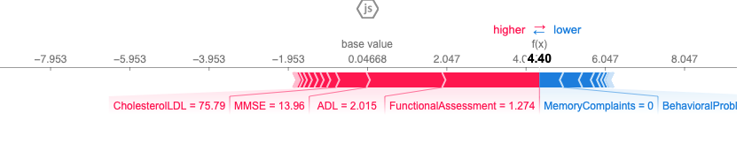

# 🧠 Alzheimer’s Risk Prediction (Machine Learning Project)

## 1. Project Overview

This project uses clinical, cognitive, and behavioral data to predict the likelihood of Alzheimer’s Disease (AD).
The goal is to build a reliable classification model and understand which patient features contribute most to Alzheimer’s risk.
Model interpretability is performed using SHAP to visualize how different features influence predictions.

---

## 2. Dataset

Source: Provided Alzheimer’s clinical dataset
Size: ~430 rows, 30+ clinical and cognitive features including...
| Feature   | Type    | Description                               | Relevance |
|-----------|---------|-------------------------------------------|-----------|
| MMSE      | Float   | Mini-Mental State Exam Score              | High      |
| ADL       | Integer | Activities of Daily Living                | High      |
| FunctionalAssessment| Integer | General functioning score       | High      |
| MemoryComplaints    | Binary | Patient reports memory issues    | High      |
| BehavioralProblems  | Binary  |  Behavioral symptoms (agitation, mood changes) |Medium|
| SleepQuality | Integer |Sleep quality rating                    | Low|
| PhysicalActivity | Integer | Activity level                     | Low |
| BMI | Float | Body Mass Index |Low|
| SystolicBP / DiastolicBP | Integer | Blood pressure measurements | Low |
| Cholesterol (LDL/HDL/Trig/Tot) | Integer | Lipid panel values   | Low–Medium |
| AlcoholConsumption | Integer | Self-reported alcohol intake     | Low |
| FamilyHistoryAlzheimers | Binary | Whether AD runs in the family | Medium |
| Diagnosis | Binary | Target variable (1 = Alzheimer’s, 0 = No Alzheimer’s) | Target |

---

## 3. Data Cleaning & Preprocessing
    
- Confirmed no missing values in core cognitive features (MMSE, ADL, FunctionalAssessment).
- Standardized column names and ensured consistent data types.
- Split dataset into train (80%) and test (20%).
- Applied standard scaling where appropriate for numerical stability.
- Encoded binary and categorical features as integers.

---

## 4. Exploratory Data Analysis (EDA)

Visualizations included KDE plots, violin plots, and correlation analysis.

Key Insights:
- FunctionalAssessment and ADL show strong separation between AD vs. non-AD groups.
- MMSE shows clear decline but has more overlap than ADL/FA.
- Behavioral and memory-related features provide additional predictive power.
- Clinical values (blood pressure, cholesterol, BMI) show very weak correlation with diagnosis.

These findings guided model selection and feature engineering.

---

## 5. Feature Engineering

Several features were engineered to capture interactions between cognitive and functional abilities:

| Feature   | Formula                                  | Purpose |
|-----------|------------------------------------------|----------|
| FA_MMSE   | FunctionalAssessment × MMSE              | Mini-Mental State Exam Score |
| ADL_MMSE  | ADL x MMSE 							   | Addresses linked deterioration patterns |
| MMSE_bin  | 1 if MMSE < threshold else 0             | Helps model "low score vs. high score" behavior|

Engineered features provided insight but did not significantly increase accuracy, which is expected given the strength of the original predictors.

---

## 6. Modeling

I experimented with several algorithms:
- Random Forest (Baseline)
- Tuned Random Forest
- Baseline XGBoost
- Tuned XGBoost (final model)

Performance was evaluated using accuracy, precision, recall, and F1-score.

Best Model: Tuned XGBoost
- Accuracy: ~0.95
- Strong recall for both classes
- Handles nonlinear interactions well

---

## 7. Evaluation

Confusion Matrix
|           | Pred 0    | Pred 1 |
|-----------|-----------|---------|
| Actual 0  | 269       | 9      |
| Actual 1  | 12        | 140    |

Observations
- Very few false negatives → extremely important in medical prediction.
- Class balance handled using weighted loss (scale_pos_weight).
- ROC and classification reports confirmed the model’s reliability.

---

## 8. Visualization

Feature Distributions
	•	KDE and violin plots showed how cognitive/functional scores differ between AD and non-AD patients.

SHAP Summary Plot

Displays global feature importance:
- FunctionalAssessment
- ADL
- MemoryComplaints
- MMSE
- BehavioralProblems
were consistently the strongest predictors.

SHAP Bar Plot

Ranks features by average impact on predictions.

SHAP Dependence Plots

Revealed:
- MMSE below ~22 dramatically increases AD probability
- ADL below ~5 has similar effects
- Functional scores heavily shape model behavior

SHAP Force Plot

Explains individual patient predictions by showing features pushing risk up or down.

These visualizations help interpret why the model makes certain predictions rather than treating it as a “black box.”

---

## 9. Key Takeaways
- FunctionalAssessment and ADL are the strongest indicators of Alzheimer’s risk.
- MMSE contributes significantly but interacts with functional scores.
- Lifestyle and standard clinical metrics show minimal predictive value in this dataset.
- XGBoost, combined with SHAP, provides both strong performance and interpretability.
- Feature engineering improved interpretability more than accuracy.

---

## 10. Tools & Libraries
- Python: Pandas, NumPy, Matplotlib, Seaborn
- Machine Learning: Scikit-learn, XGBoost
- Interpretability: SHAP
- Notebook environment: Jupyter
